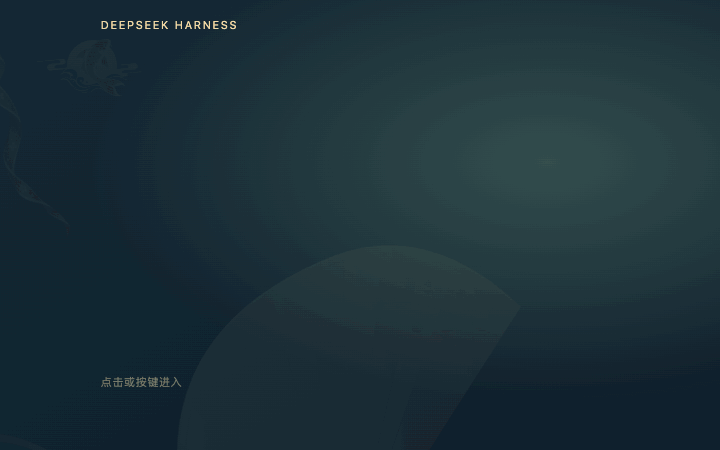

# DSH Entrance

[](https://github.com/AAAholic/dsh-entrance/actions/workflows/ci.yml)
[](https://github.com/AAAholic/dsh-entrance/releases/latest)

一个可安装、可拆解学习的 DeepSeek Harness 入场动画插件：宵宫分层登场、轻轻挥手、错时烟花、连续错峰跃水的鱼群、随风飘带，以及从点击位置扩散的水波退出。

**非官方社区项目**，与 DeepSeek、上游作者及示例角色权利方无隶属、赞助或背书关系。

大家最喜欢的两部分完整保留：**各层依次出现的分镜**，以及**水波逐步擦除欢迎画面、露出真实工作台的交接**。



本项目从本地 `whale-girl` 扩展提取，只保留欢迎场景；不需要宠物、工作壁纸、模型 API 或远程图片服务。

- **代码与代码文档采用 MIT**，保留上游版权声明并补充本项目贡献者署名。
- **四张示例 PNG 与演示 GIF 不在 MIT 范围内，本仓库不授予素材权利**。发布自己的版本时，请使用有权分发的素材与演示媒体，详见 [LICENSE-ASSETS](LICENSE-ASSETS)。
- **示例画面经 AI 生成或编辑**（ChatGPT / gpt-image）。原 PNG 内含 C2PA 记录，请保留；发布图片或动画录屏时声明其中的 AI 生成画面。参考图流程与清单记录见 [NOTICE.md](NOTICE.md)。

想制作自己的主题，先看 [通用创作流程](docs/CREATIVE-WORKFLOW.md)：找参考、准备素材、多版筛选，再分层实现、预览迭代和验证发布。

## 安装到 DSH

目标接口按 **DSH 0.1.7-rc.2** 的官方 bundle 契约适配。其他版本请先查看宿主是否支持相同插件结构。

在 DSH 的插件管理页面选择“添加插件”，在“包名或地址”中填入：

```text
https://github.com/AAAholic/dsh-entrance
```

等待安装结束，再启用 `dsh-entrance`。仓库包含预构建的 `lib/client.js`，普通安装不需要先构建。这里使用 GitHub 仓库地址，**没有声明已发布到 npm registry**，不要只填 `dsh-entrance` 包名。

需要固定版本时，从 [Releases](https://github.com/AAAholic/dsh-entrance/releases/latest) 下载 `.tgz` 安装包，在同一输入框填写文件绝对路径或附件的直接下载地址。每个 Release 附版本说明、验证链接和 `SHA256SUMS`。

也可以下载/克隆本仓库，在同一输入框填写仓库根目录的**绝对路径**。本地目录中应能看到 `package.json`、`cordis.patch.yml` 和 `lib/`。

宿主安装器支持 Git 仓库、本地绝对路径和 `.tgz` 文件/直链；GitHub 与 `.tgz` 直链直接访问对应站点，更换 npm 安装源不会代替这部分网络连接。上述输入形式已核对本地 DSH 插件管理器的实际解析逻辑与界面文案。

启用后可从右上角“入场设置”“重播入场”操作，或使用 `Alt+Shift+W` 打开设置。宿主设置页同时提供“入场动画”分区。已有启动弹窗或用户已经开始输入时，会跳过本轮自动欢迎。

如果还装有带入场功能的旧版 `whale-girl`，请在宿主插件页停用其中一个插件，避免同时启用两套入场控制器。独立插件会避让已存在的旧欢迎层，但旧插件的外部重播事件可能反向叠加，两者也共用 `Alt+Shift+W`，可能同时打开设置。仅关闭一方自动欢迎并不能解决全部手动重播与快捷键冲突。

## 可调内容

| 控件 | 范围/默认 | 含义 |
| --- | --- | --- |
| 烟花亮度 | `0–100%`，默认 `50%` | `50%` 保留原来的默认效果；`100%` 提高发光强度 |
| 挥手幅度、挥手速度 | 各 `0–100%`，默认 `50%` | 幅度与相位速度独立控制，结束时回到原姿态 |
| 左侧飘带摆幅、速度 | 各 `0–100%`，默认 `50%` | 顶端固定、尾部摆动；高幅度留出额外绘制边距 |
| 游鱼跃起幅度、速度 | 各 `0–100%`，默认 `50%` | 沿弧线连续错峰跃水，起落伴随短水纹 |
| 游鱼数量 | `2 / 3`，默认 `3` | 大小、轮廓与红金/青金配色不同 |
| 展开时长 | `1.5–5.0 s`，默认 `3.2 s` | 只调整入场分镜；不含停留和 `2.2 s` 水波退出 |

百分比控制的 `50%` 是旧基准，`100%` 是两倍参数增益；不表示感知亮度线性翻倍，透明度仍受有效范围限制。`0%` 对应熄灭或停止相应动作。

提供自动欢迎、总动画、烟花、飘带与游鱼开关，以及静谧/轻盈/祭典预设。关闭动画或开启系统“减少动态”时保留静态构图，退出立即完成。偏好只保存在当前浏览器/宿主 origin 的 `localStorage`，下次重播生效。

## 本地预览与开发

需要 Node.js **22 或更高版本**。在仓库根目录执行：

```sh
npm install
npm run build
npm test
npm run preview
```

仓库提供 `pnpm-lock.yaml`。需要按锁文件复现依赖时，可用 `pnpm install --frozen-lockfile` 替代 `npm install`，再运行相同 scripts；不要把重新解析的 npm 依赖结果误称为同一份锁定环境。

终端会显示本地预览地址，默认端口为 `4320`。这是带示例输入框和点击计数器的浏览器工作台，便于检查退出手势与焦点，不含私人聊天内容。`Ctrl+C` 停止预览。

修改 `lib/client/` 源码后重新构建；不要手改 `lib/client.js`。检查生成物与浏览器行为：

```sh
npm run check
npx playwright install chromium
npm run test:browser
```

浏览器验证生成 `test-results/`，包含报告与截图。它验证独立控制器、实际素材、设置、退出、防穿透和窄屏；不能代替原生 Electron 的帧率或完整视觉验收。

生成可分发安装包：

```sh
npm run build
npm pack
```

当前版本生成 `dsh-entrance-1.0.1.tgz`。在 DSH 添加插件时填这个文件的绝对路径即可使用本地压缩包安装方式。`npm pack` 是本地打包，不会发布到 npm；生成包包含代码、预构建客户端、素材、许可和文档，开发脚本在 Git 仓库中。

## CI 与版本发布

GitHub CI 在 `main` 提交和 Pull Request 上运行：锁定依赖安装、构建一致性、单元测试、Chromium 浏览器检查，再打包并核对包内文件、许可和素材哈希。通过后保留安装包与校验文件，浏览器报告和截图另作检查证据。

维护者发版时，更新 `package.json` 版本并准备 `docs/releases/v版本.md`，提交首行使用 `release: v版本`。该提交的验证任务通过后，发布任务才会创建对应 Tag/Release，并使用同一次 CI 的安装包。普通提交不会发布版本，已发布版本不会被覆盖；不发布到 npm registry。

本地也可执行 `pnpm pack --pack-destination dist` 和 `pnpm run check:package` 检查安装包。当前 CI 使用 Node 22、固定 pnpm 与锁文件；它不替代原生 DSH 的视觉或性能验收。

## 实现与问题总结

| 想了解 | 文档 |
| --- | --- |
| 如何从找参考、多版图像筛选走到可运行模板 | [通用创作流程](docs/CREATIVE-WORKFLOW.md) |
| 人物、表情和装饰素材该怎么准备 | [素材规格](docs/ASSET-SPEC.md) |
| 换成自己的人物、配色、装饰与插件名 | [模板替换教程](docs/TEMPLATE-GUIDE.md) |
| 插件结构、接口、存储、资源路由 | [架构](docs/ARCHITECTURE.md) |
| 分镜时间与构图关系 | [分镜与节奏](docs/STORYBOARD.md) |
| 最后水波如何真正擦除画面 | [水波退出](docs/WATER-EXIT.md) |
| 性能、黑块、接缝、输入穿透、宿主适配等问题 | [问题总结](docs/LESSONS-LEARNED.md) |
| 历史验证的范围与限制 | [验证历史](docs/VERIFICATION-HISTORY.md) |
| 上游、人物与装饰素材来源 | [素材说明](docs/ASSETS-LICENSE.md) |

建议先阅读 [welcome-scene.mjs](lib/client/welcome-scene.mjs) 和 [welcome-water.mjs](lib/client/welcome-water.mjs)，理解时钟与遮罩；再看角色、飘带和鱼群模块。纯视觉层使用 DOM、SVG、Canvas 2D 和 Web Animations API，没有引入 Live2D SDK。

Git 的首个公开版本是从已有工程提取的基线；历史问题如实整理为文档，不伪造以前的逐次提交。后续修改由真实提交和版本标签记录。

## 验证范围

2026-10-06 的独立包检查结果：

| 检查 | 结果 | 覆盖范围 |
| --- | --- | --- |
| Node 测试 | `16/16` 通过 | 路径/服务、偏好迁移与游鱼逻辑 |
| 实际浏览器 | `20/20` 通过 | 独立控制器、实际素材、设置、跃水、退出、焦点及窄屏 |
| 真实 DSH boot | 通过 | bundle 兼容判定、patch 解析与挂载契约 |
| 官方 Cordis `4.0.4` 生命周期 | `2/2` 通过 | 缺依赖不挂载，注入/移除/恢复，fiber 停用，资源路由重启无残留 |

Cordis 生命周期测试使用真实宿主生命周期，客户端 DOM/React 由测试替身承担；它不证明真实渲染。真实渲染和交互由另列的浏览器检查覆盖。

本机原生桌面检查针对原有 `whale-girl` 中的增强入场，**不能冒充这个独立 bundle 的原生桌面验收**；本表没有声明独立 bundle 已通过原生 Electron 视觉验收。

未保证全部 DSH 版本、操作系统与 GPU 的表现。冷启动与重播、浏览器与原生桌面、技术通过与审美接受分别记录。

上游为 [vlln/whale-girl](https://github.com/vlln/whale-girl)，原 MIT 版权声明保留，并补充本项目贡献者署名。本项目不是上游作者、DeepSeek 或角色权利方的官方发布；示例角色宵宫的权利归米哈游 / HoYoverse。代码许可、示例素材与第三方权利的边界见 [LICENSE](LICENSE)、[LICENSE-ASSETS](LICENSE-ASSETS) 和 [NOTICE.md](NOTICE.md)。
