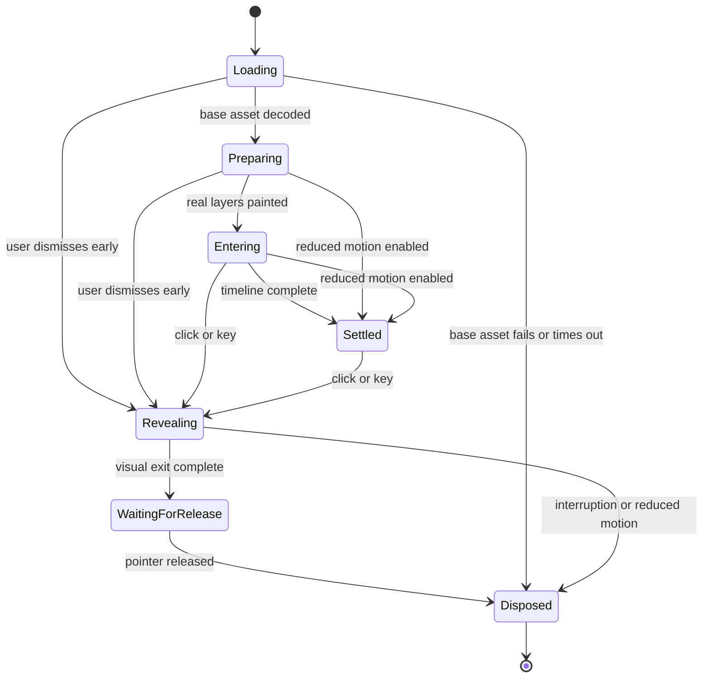

# 如何把入场动画拆成独立插件

这个项目提取的是 DSH 欢迎场景。它源于 `whale-girl` 的本地扩展，但不需要宠物状态机、投喂、任务奖励、会话事件、工作壁纸或模型 API。

## 三层职责

| 层 | 职责 | 不应承担的工作 |
| --- | --- | --- |
| `lib/index.mjs`、`client/index.mjs`、`controller.mjs` | 插件生命周期、设置、是否自动播放、模态输入、焦点、后台与减少动态策略 | 每帧绘制角色和水波 |
| `welcome-scene.mjs` | 统一入场时钟、图层顺序、素材准备、退场时钟、临时工作台动画 | 宠物业务、聊天状态、远端图片下载 |
| 局部视觉模块 | 角色关节、烟花、水波、飘带、游鱼、静态装饰 | 注册全局快捷键、修改宿主业务状态 |

局部模块只接收容器、资源 URL 和视觉参数。场景负责协调它们。减少动态和退出输入由最外层统一决定，不能让每个 Canvas 自己决定是否退出。公开的最外层入口为 `mountEntrance({ autoStart = true })`；已存在独立控制器时返回 `null`，避免重复挂载。

## 模块地图

| 模块 | 主要接口 | 关键约束 |
| --- | --- | --- |
| `welcome-scene.mjs` | `prepareWelcomeAssets()`、`mountWelcomeScene()` | 自己管理加载、主 RAF、入场和退场；返回 `setPaused`、`setMotion`、`dismiss`、`dispose` |
| `welcome-character.mjs` | `mountWelcomeCharacter(container, {imageURL, expressionURL, blink, amplitude, speed})` → `update(t)`、`dispose()` | 只消费设计时间，不创建循环；SVG 负责裁切，外层 HTML 负责变换 |
| `welcome-fireworks.mjs` | `createWelcomeFireworks()` → `update(t,w,h)`、`dispose()` | 有限烟花共用主时钟，不在完成后继续运行 |
| `welcome-water.mjs` | `welcomeWaterWaves()`、`createWelcomeWater()` | 纯几何函数同时服务水体与揭幕遮罩，避免二者不同步 |
| `welcome-ribbon.mjs` | `mountWelcomeRibbon(container, {imageURL, motion, amplitude, speed})` | 局部形变，固定顶端；独立低频绘制；可暂停、冻结、销毁 |
| `welcome-river.mjs` | `mountWelcomeRiver(container, {motion, amplitude, speed, fishCount})` | 错峰弧线跃水与水纹；独立低频绘制；窄屏独立布局 |
| `welcome-ornaments.mjs` | SVG 标记 | 折扇、红屏、波带等不需要每帧重建的装饰 |

`freeze()` 与 `setPaused(true)` 的语义不同：暂停后可以继续；退场冻结保留当前图像，此实例不再恢复动作，直到销毁。

## DSH bundle 契约

目标宿主采用官方 bundle 分发结构：

1. `package.json` 的 `dsh.bundle.patch` 指向包内 `cordis.patch.yml`。
2. patch 的 `insert` 条目挂载 Node half，条目 ID、插件名与客户端注册 ID 保持一致。
3. `dsh.client.platform` 为 `web`，预构建客户端通过 `window.__ModuleLoader__.load({ id, factory })` 注册。
4. 客户端导出 `name` 与 `apply(ctx)`；卸载时释放所有属于本插件的资源，释放函数由 `ctx.effect()` 明确托管。
5. Node half 导出 `inject = ['webServer']`，只提供本地资源路由；没有宠物状态存储或会话订阅。Client half 导出 `inject = ['slots']`，通过 `settings.section` 注册“入场动画”。

视觉模块只使用 DOM、SVG、Canvas 2D、Web Animations API、`requestAnimationFrame` 和 `ResizeObserver`。不依赖 Live2D SDK、Three.js 或额外 Electron 进程。构建层使用 esbuild，浏览器测试使用 Playwright；设置插槽包装层的 `react` 由 DSH 宿主提供并在构建中 external，不加入运行时 npm 依赖。本包不依赖 schema 库。

## 资源与宿主隔离

- `lib/src/routes.mjs` 定义资源前缀 `/dsh-entrance/assets`，场景使用其下 `entrance/20261006/` 的四张 PNG，不依赖 `/whale-girl/assets/`。目前素材基址是模块常量，不是运行时可配置参数。
- Node half 只接受资源 `GET`/`HEAD`；路径守卫拒绝空段、点段、反斜杠与空字符，设置正确 MIME 和 `nosniff`。独立包当前使用 `Cache-Control: no-cache`；历史上游的 `immutable` 策略不直接继承。
- 欢迎内容放在 Shadow DOM 中；全屏 host 明确设置定位、层级、不透明背景与输入归属。
- 工作台揭幕使用现有宿主节点，只给它添加可取消的临时动画。没有该节点，或该节点包含欢迎层时，跳过工作台浮起即可。
- 不复制工作台 DOM，不读取聊天内容，不截取宿主界面作为背景纹理。
- CSS、监听器、Observer、RAF、定时器、动画对象、Canvas 缓冲及未完成加载都必须有所有者和释放路径。

## Cordis 生命周期的实际契约

官方 Cordis `4.0.4` 会把普通 `export function apply(ctx)` 按可构造函数路径处理。不能假设 `return dispose` 会自动注册清理；`ctx.on('dispose', ...)` 也不是此路径的 fiber 资源回收契约。

`lib/index.mjs` 和 `lib/client/index.mjs` 都创建带 `disposed` 守卫的幂等释放函数，再由 effect 托管：

```js
let disposed = false
const dispose = () => {
  if (disposed) return
  disposed = true
  // Release only resources owned by this plugin instance.
}
ctx.effect(() => dispose, 'dsh-entrance.client')
return dispose
```

服务端使用 `dsh-entrance.assets` 标签，释放注册路由；客户端使用 `dsh-entrance.client`，释放设置插槽和控制器。保留返回值便于直接调用方显式释放，但自动停用依赖 effect。重复调用不会二次释放资源。

`inject = ['slots']` 让缺服务时不挂载客户端，依赖移除时卸载，恢复后重新建立一个实例；`['webServer']` 对资源路由同理。真实 Cordis 检查覆盖这些依赖切换、fiber 停用及路由重启无残留。该测试中的 DOM/React 使用替身，实际视觉需另做浏览器检查。

## 同一状态机覆盖正常与异常路径



后台暂停是上述状态的正交条件，不必复制一套“后台状态机”。暂停时清空上一帧时间戳，恢复时从当前进度继续，避免把后台停留时间加进动画。

焦点记录通过 `focusedElement()` 从 `document.activeElement` 递归进入每层 `shadowRoot.activeElement`，保存真正的按钮/输入框，而不是只保存 Shadow DOM 的 host。关闭设置前先检查面板确实处于打开状态；已经隐藏的面板不能再次恢复旧焦点，避免重播时把焦点从当前控件抢走。

## 设置与控制器契约

偏好键为 `dsh.entrance.preferences.v2`，只在当前 origin 的 `localStorage` 保存。跨窗口 `storage` 事件同步偏好并关闭旧场景；存储失败时仍保留本次会话设置，并显示状态提示。

控制器返回 `defaultPreferences`、`getPreferences()`、`subscribe()`、`save(patch)`、`replay()`、`canReplay()`、`getStatus()` 和 `dispose()`。`getStatus().active` 表示控制器可用，`sceneActive` 表示当前有欢迎层，两者不能混用，否则关闭欢迎后所有设置也会被禁用。

右上角常驻入口为单一“动画设置”按钮，重播操作位于设置面板内。浮动面板与宿主设置分区共用 `mountMotionSettings(..., { welcomeOnly: true })`，仅显示欢迎控件。底层模型为兼容已有视图仍含旧壁纸字段，但独立插件不渲染工作壁纸，也不显示其控件。

| 字段 | 默认/有效范围 |
| --- | --- |
| `entrance`、`welcomeMotion`、`fireworks`、`ribbonMotion`、`riverMotion` | 默认 `true` |
| `fireworkIntensity` | 默认 `50`，范围 `0…100` |
| `handAmplitude`、`handSpeed` | 各默认 `50`，范围 `0…100` |
| `ribbonAmplitude`、`ribbonSpeed` | 各默认 `50`，范围 `0…100` |
| `riverAmplitude`、`riverSpeed` | 各默认 `50`，范围 `0…100` |
| `fishCount` | 默认 `3`，有效整数 `2 / 3` |
| `duration` | 默认 `3.2` 秒，范围 `1.5…5` |
| `welcomeScaleVersion` | 当前写入 `2` |

外部可派发 `dsh-entrance:replay` 或 `dsh-entrance:settings` DOM 事件。快捷键为 `Alt+Shift+W`。自动欢迎不依赖皮肤名或壁纸加载：准备素材后尝试一次；已有 dialog、旧 `data-yoimiya-controller`、用户已经输入或关闭自动欢迎时跳过。手动重播只避让实际存在的旧 `data-yoimiya-entrance`。

## 参数设计

界面百分比使用 `gain = value / 50`：`50%` 表示旧默认效果，`100%` 提供两倍基准增益。烟花低于中点时降低图层 opacity，高于中点时提高逐粒子亮度并钳制合法 alpha；不是把无效的 opacity `2` 写给浏览器。

幅度改变角度或位移，速度改变相位推进，二者应独立。手部速度还要保留开始与结束的包络，使最后一帧回到原姿态；飘带增幅必须同时核对局部 Canvas 边距，避免摆动被裁掉。

偏好解析集中在 `wallpaper-preferences.mjs`：拒绝非有限数值、钳制范围、给缺失字段补默认值。仅对未带 `welcomeScaleVersion: 2` 的旧烟花记录执行除二迁移，并输出版本号，使再次读取保持幂等；缺失的新动作字段直接填 `50`。
